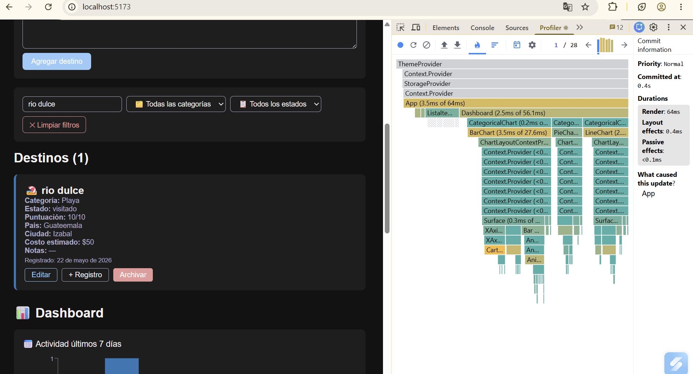
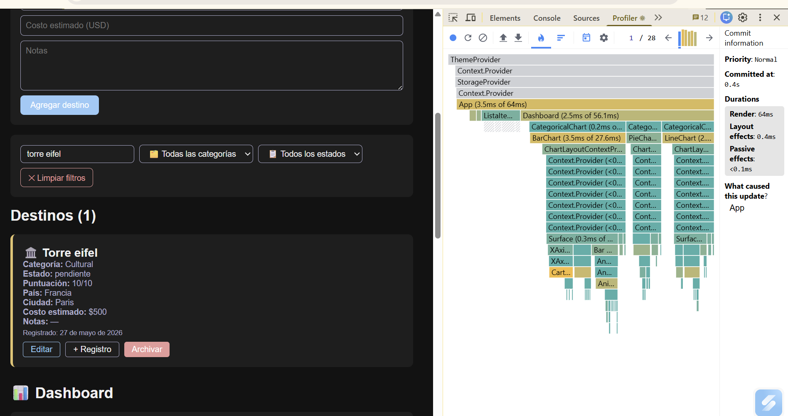

# 🌍 Mis Viajes — Proyecto 2

**Demo:** https://proyecto2-sistemas-45b9.vercel.app  
**Backend:** https://hospitable-motivation-production-a0ec.up.railway.app/api/items  
**Repositorio:** https://github.com/Diana-Sosa18/proyecto2-sistemas

---

## Screenshots

### Profiler antes de useMemo


### Profiler después de useMemo


---

## Stack tecnológico

| Tecnología | Versión | Uso |
|---|---|---|
| React | 19 | Frontend UI |
| Vite | 8 | Bundler |
| Express | 5 | Backend API |
| PostgreSQL | 15 | Base de datos |
| Recharts | 2.13 | Gráficas |
| Railway | — | Deploy backend |
| Vercel | — | Deploy frontend |

---

## Cómo correr localmente

**Frontend:**
```bash
cd fase1-viajes/frontend
npm install --legacy-peer-deps
npm run dev
```

**Backend:**
```bash
cd fase1-viajes/backend
npm install
npm run dev
```

Variables de entorno del backend (crear `.env`):

---

## Mis primeros Items (Fase 1)

Los primeros destinos que agregué al proyecto:

1. **Antigua Guatemala** — Cultural · Guatemala · Pendiente
2. **Cancún** — Playa · México · Pendiente
3. **Machu Picchu** — Montaña · Perú · Pendiente

---

## Mi paleta de colores (Fase 2)

### Tema claro
| Color | Hex | Justificación |
|---|---|---|
| Fondo | #f0f4f8 | Azul muy claro que evoca el cielo y el mar |
| Superficie | #ffffff | Blanco puro para tarjetas |
| Texto | #1a1a2e | Azul muy oscuro casi negro |
| Texto secundario | #555577 | Azul grisáceo para información secundaria |
| Primario | #0077B6 | Azul océano, representa viajes y agua |
| Peligro | #e53935 | Rojo para archivar |

### Tema oscuro
| Color | Hex | Justificación |
|---|---|---|
| Fondo | #121212 | Negro suave estándar de modo oscuro |
| Superficie | #1e1e1e | Gris muy oscuro para tarjetas |
| Texto | #f0f0f0 | Blanco suave |
| Texto secundario | #aaaacc | Lavanda grisácea |
| Primario | #90CAF9 | Azul claro pastel |
| Peligro | #ef9a9a | Rojo pastel suave |

---

## Gráfica original + decisiones técnicas (Fase 3)

### Mi gráfica original
La tercera gráfica muestra la **puntuación promedio por categoría** con un LineChart. La elegí porque permite comparar qué tipo de destino tiene mejor puntuación según la experiencia personal, ayudando a decidir qué categoría priorizar en futuros viajes.

### Mis 3 decisiones técnicas

**(1) Estructura del reducer:**
Organicé las acciones en orden de frecuencia de uso: HIDRATAR una sola vez al inicio, luego AGREGAR/ELIMINAR para el CRUD, y FILTRAR para las búsquedas que ocurren constantemente. Cada caso devuelve un nuevo objeto con spread operator sin mutar el estado anterior.

**(2) Acción más difícil — REGISTRAR_ACTIVIDAD:**
Fue la más compleja porque necesitaba actualizar un campo anidado dentro de `atributos` sin mutar el objeto original. Lo resolví con spread anidado: `{ ...item, atributos: { ...item.atributos, ultimoRegistro: payload.notas } }`.

**(3) Gráfica más compleja — Puntuación promedio:**
Transforma el array de items en un array de promedios por categoría usando `reduce()` para sumar puntuaciones y dividir entre el total. Filtra categorías sin puntuaciones para no mostrar datos vacíos.

---

## Performance — Profiler (Fase 3)

Con useMemo, el componente ListaItems y los ItemCard dejan de re-renderizarse cuando el usuario escribe en el buscador si el resultado filtrado no cambia. Sin useMemo, cada tecla recalcula toda la lista y fuerza un re-render de todos los ItemCard aunque ningún dato haya cambiado. Con React.memo en ItemCard, aunque App se redibuje, cada tarjeta individual solo se actualiza si su prop `item` cambió.

---

## Hooks usados (Fase 4)

| Hook | Archivo | Qué hace |
|---|---|---|
| useLocalStorage | src/hooks/useLocalStorage.js | Sincroniza estado con LocalStorage automáticamente |
| useFetch | src/hooks/useFetch.js | Fetch con estados loading/error y AbortController para cancelar peticiones |
| useAtajoTeclado | src/hooks/useAtajoTeclado.js | Registra atajos de teclado con cleanup automático al desmontar |
| useRacha | src/hooks/useRacha.js | Calcula la racha de días consecutivos de actividad en destinos |

---

## Sobre mí

**Nombre:** Diana Sosa  
**Carnet:** 241040  

Este proyecto me enseñó a estructurar una aplicación React completa desde cero, desde el manejo de estado con hooks hasta el deploy en producción. Lo más valioso fue entender cómo cada fase construye sobre la anterior y cómo separar responsabilidades entre componentes, contextos y el backend.

