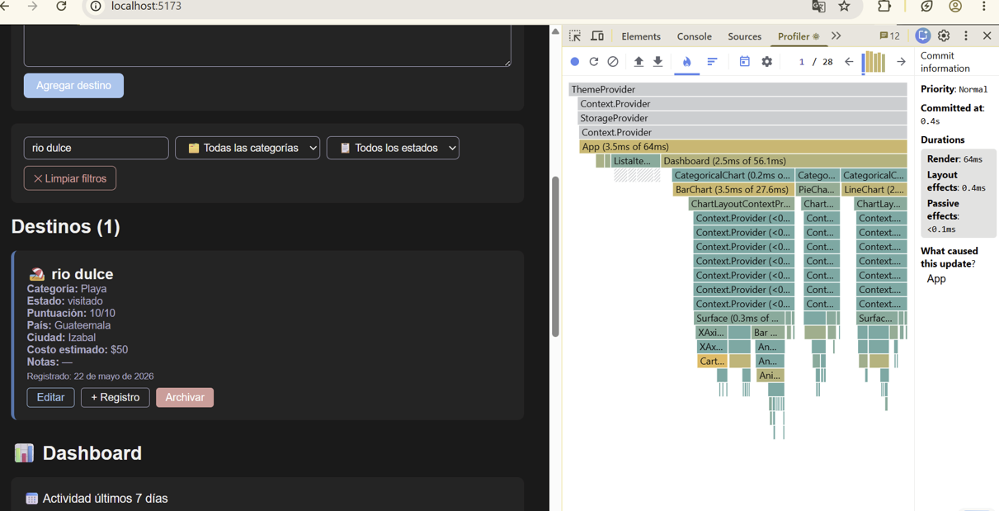
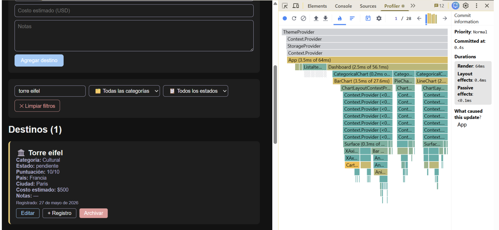

# React + Vite

This template provides a minimal setup to get React working in Vite with HMR and some ESLint rules.

Currently, two official plugins are available:

- [@vitejs/plugin-react](https://github.com/vitejs/vite-plugin-react/blob/main/packages/plugin-react) uses [Oxc](https://oxc.rs)
- [@vitejs/plugin-react-swc](https://github.com/vitejs/vite-plugin-react/blob/main/packages/plugin-react-swc) uses [SWC](https://swc.rs/)

## React Compiler

The React Compiler is not enabled on this template because of its impact on dev & build performances. To add it, see [this documentation](https://react.dev/learn/react-compiler/installation).

## Expanding the ESLint configuration

If you are developing a production application, we recommend using TypeScript with type-aware lint rules enabled. Check out the [TS template](https://github.com/vitejs/vite/tree/main/packages/create-vite/template-react-ts) for information on how to integrate TypeScript and [`typescript-eslint`](https://typescript-eslint.io) in your project.

## Fase 3: useReducer · Recharts · Optimización

### useReducer — 7 acciones
- **HIDRATAR** — carga inicial del array desde API o LocalStorage
- **AGREGAR** — añade un nuevo destino al array
- **ELIMINAR** — archiva el destino (activo = false)
- **CAMBIAR_ESTADO** — actualiza el estado y fechaActividad del destino
- **FILTRAR** — actualiza filtroCategoria, filtroEstado o busqueda
- **LIMPIAR_FILTROS** — resetea todos los filtros a su valor inicial
- **REGISTRAR_ACTIVIDAD** — agrega un registro de actividad al historial

### Mi gráfica original
La tercera gráfica muestra la **puntuación promedio por categoría** usando un LineChart. La elegí porque en un tracker de viajes es útil saber qué tipo de destino (playa, ciudad, montaña) tiene mejor puntuación promedio según tu experiencia personal, ayudando a decidir qué categoría priorizar en futuros viajes.

### Mis 3 decisiones técnicas

**(1) Estructura del reducer:**
Organicé las acciones en orden de frecuencia de uso: HIDRATAR una sola vez al inicio, luego AGREGAR/ELIMINAR para el CRUD, y FILTRAR para las búsquedas que ocurren constantemente. Cada caso devuelve un nuevo objeto con spread operator sin mutar el estado anterior.

**(2) Acción más difícil — REGISTRAR_ACTIVIDAD:**
Fue la más compleja porque necesitaba actualizar un campo anidado dentro de `atributos` sin mutar el objeto original. Lo resolví con spread anidado: `{ ...item, atributos: { ...item.atributos, ultimoRegistro: payload.notas } }`.

**(3) Gráfica más compleja — Puntuación promedio:**
Transforma el array de items en un array de promedios por categoría usando `reduce()` para sumar puntuaciones y dividir entre el total. Filtra categorías sin puntuaciones para no mostrar barras vacías.

### Optimización con useMemo y useCallback
- `listaFiltrada` con useMemo solo recalcula cuando cambian lista o filtros
- `estadisticas` con useMemo evita recalcular totales en cada render
- Handlers envueltos en useCallback para no recrear funciones en cada render
- ItemCard exportado con React.memo para no rerenderizar si sus props no cambian

### Profiler — Antes y Después

**Antes de useMemo:**

**Después de useMemo:**

**Análisis:**
Con useMemo, el componente ListaItems y los ItemCard dejan de re-renderizarse cuando el usuario escribe en el buscador si el resultado filtrado no cambia. Sin useMemo, cada tecla que el usuario presiona recalcula toda la lista y fuerza un re-render de todos los ItemCard aunque ningún dato haya cambiado. Con React.memo en ItemCard, aunque App se redibuje, cada tarjeta individual solo se actualiza si su prop `item` cambió.